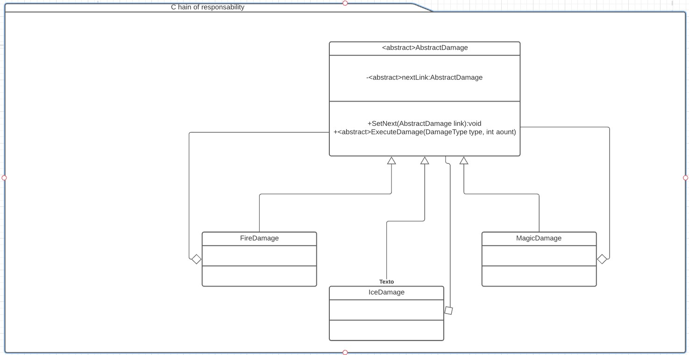

# Chain of responsability
Es un patrón de comportamiento. [Link descripción](https://sourcemaking.com/design_patterns/chain_of_responsibility)

Define una serie de objetos dispuestos a atender un método especifico. Si el objeto no puede atender el pedido, llama al siguiente y así sucesivamente hasta terminar la cadena.

## Diagrama uml

## SOLID

*Single responsability

* Open/Closed principle

* Liskov substitution

* Interface segregation

* Dependency inversion